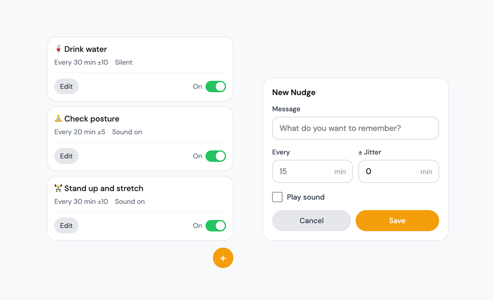

<p align="center">
  
</p>

<h1 align="center">Nudge</h1>

<p align="center">A Chrome extension for recurring reminders with custom intervals, jitter, and sound.</p>

<p align="center">Chrome · Manifest V3</p>
<p align="center"><a href="#install"><strong>Install Nudge</strong></a></p>

<p align="center">
  
</p>

## Install

1. Clone or download this repository
2. Open `chrome://extensions` in Chrome
3. Enable **Developer mode** (top-right toggle)
4. Click **Load unpacked** and select the project folder
5. Click the extension icon to open the reminders popup

## Features

**Multiple reminders** — Create as many recurring reminders as you need. Each one runs independently on its own timer.

**Custom intervals** — Set reminders from seconds to hours. Type any interval in minutes — `0.5` for 30 seconds, `60` for hourly, whatever you need.

**Jitter** — Add randomness to intervals so reminders don't feel robotic. A 30-minute interval with ±5 jitter fires somewhere between 25–35 minutes. Keeps you on your toes.

**Sound toggle** — Turn notification sounds on or off per reminder.

**Pause / Resume** — Toggle any reminder on or off without deleting it. Pick up where you left off.

**Persistent** — Reminders survive browser restarts. The service worker automatically restores any missing alarms when Chrome relaunches.

## File Structure

```
nudge/
  manifest.json      Extension config (Manifest V3)
  background.js      Service worker (alarms, notifications, jitter logic)
  popup.html         Popup UI
  popup.js           Popup logic (CRUD, toggle, form)
  styles.css         Popup styles
  icons/             Extension icons (16, 48, 128px)
```

## Privacy

This extension does not make any network requests. There is no server, no analytics, and no tracking.

Reminder data is stored using `chrome.storage.sync` (syncs across your Chrome devices). Notification logs are stored locally using `chrome.storage.local`. Nothing is sent to any third party.

**Permissions:**
- **Notifications** — to show reminder alerts
- **Storage** — to save your reminders
- **Alarms** — to schedule recurring timers

## Requirements

- Chrome (or Chromium-based browser)

## License

[MIT](LICENSE)
